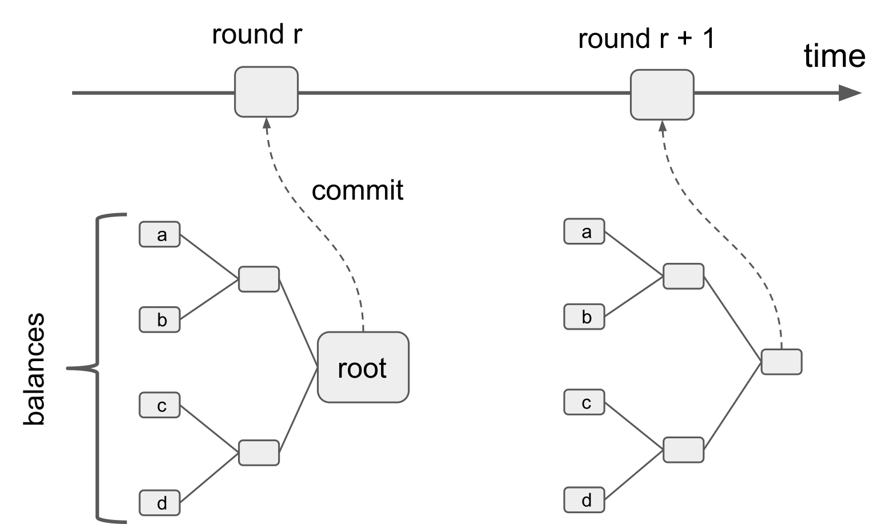
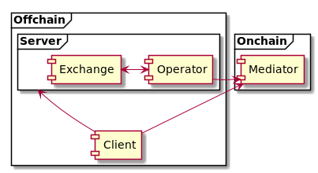
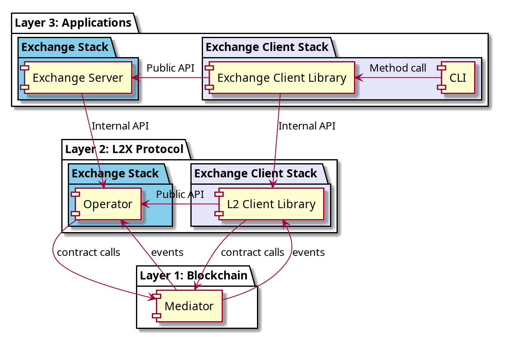
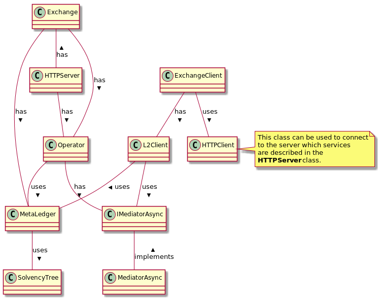

# Architecture

## Protocol Introduction

The L2X protocol describes a high-performance, scalable, trustless exchange
stack.

The server stack consists of an exchange server that works together with
an L2X protocol operator ("operator" for short) and smart contract (also known
as the "mediator") to provide exchange services *trustlessly*.

Being a trustless exchange gives user the assurance that the exchange is
solvent, has faithfully carried out all trading instructions, and correctly
maintained asset balances. The operator and smart contract helps the
exchange to attain this capability by operating a *commit-chain*.

*Commit-chain visualization*

The operator produces a cryptographic commitment of the funds maintained by the
exchange at regular intervals and commits that cryptographic commitment to the
mediator.

In addition to the cryptographic commitment, the operator also makes
cryptographic proofs available to the exchange client software. With the proofs,
the client software is able to automatically verify the correctness of the
committed balances by consulting the mediator.

In addition to providing balances verification, the operator and mediator also
provide a range of services for funds protection, recovery, and withdrawal.

## Architecture Overview

## Components & APIs

The three main components of the system are:
 * The *Server* which contains the *Exchange* and the *Operator*
 * The *Client* 
 * The *Mediator* smart contract 
 
 Each of these components can be accessed by their respective API:

| Component    | Public API                                               |
| ------------ | -------------------------------------------------------- |
| Server       | Defined in `src/server/HTTPServer.ts`                    |
| Client       | Defined in `src/client/ExchangeClient.ts` See also [Exchange Client Library](./docs/Client_ExchangeClient.md)         |
| Mediator     | Can be accessed through the wrapper defined in `src/common/mediator/Contract.ts`     |
 
 
## Layers

The server and client stacks are divided into 3 layers.

| Layer        | Services Provided                                        |
| ------------ | -------------------------------------------------------- |
| Application  | Exchange services (e.g. order books, matching engine, etc). |
| Protocol     | Trustless capabilities.                                  |
| Blockchain   | Decentralized consensus and immutable recordkeeping.     |
 

### Class diagram

In the simplified class diagram above we can see in more details the internal structure 
 of the main components.
 
The exchange logic is implemented in the class **Exchange**. 
Note that in our implementation the **Exchange** is aware of the **Operator**.
For example when the **Exchange** receives a request of a new client who wants to join,
 the method **Operator.admit()** will be called. The exchange also relies on the operator
 for signing fills between others.
The **Exchange** class is in particular responsible for defining a fee structure.
 
The client will interact through the class **ExchangeClient** that encapsulates the logic
 for interacting with the exchange (through class **HTTPClient** that will allow to consume services
  described in **HTTPServer**) and also directly with the mediator through the class **L2Client**.
This class contains the implementation of the *layer 2* logic for the client such as fetching the fills 
 at the beginning of the round, auditing the proofs, confirming withdrawals etc...
 
The **Operator** class contains the logic of the operator, including committing the roots of each assets
 at the beginning of each round, canceling withdrawals, closing disputes etc...
The accounting and its persistence is handled by the class **Metaledger**. 
Note that this class is shared with the **Exchange** class. It is important to highlight that both **Exchange** and
**Operator** classes have access to the same database.

The **L2Client** class enables the client to interact with the mediator. It also handles accounting 
(independently from the exchange) using the **MetaLedger** class.

The logic related to Merkle trees is used by the class **MetaLedger** and implemented in the class *SolvencyTree*.

* * *
&copy; 2019 OAX Foundation
